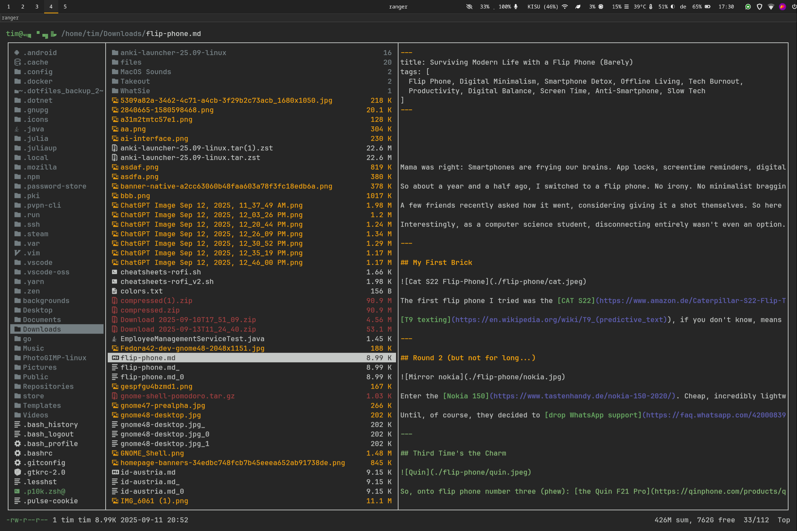
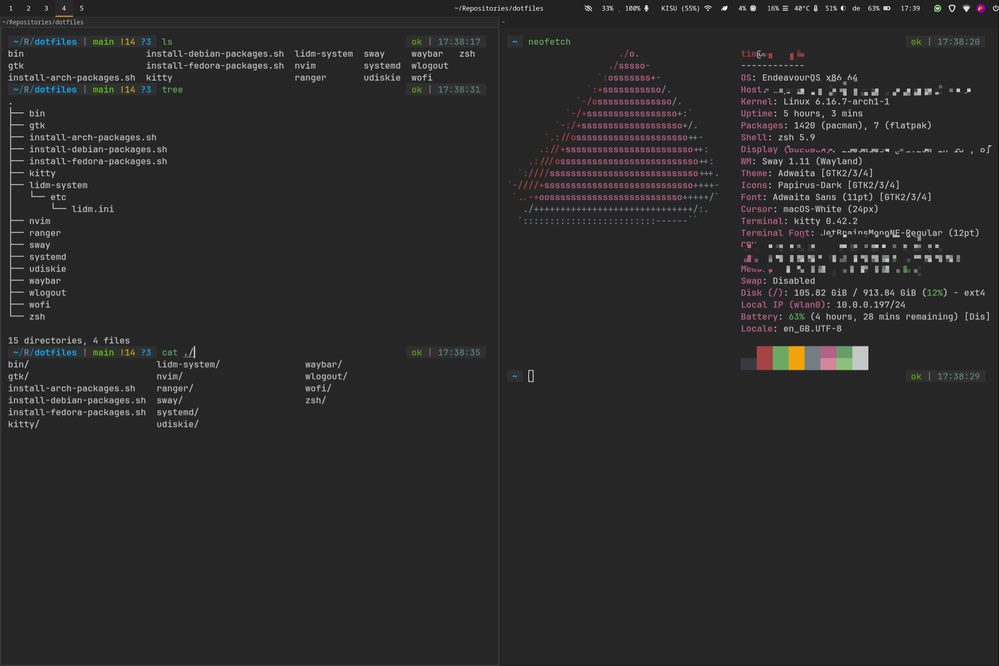
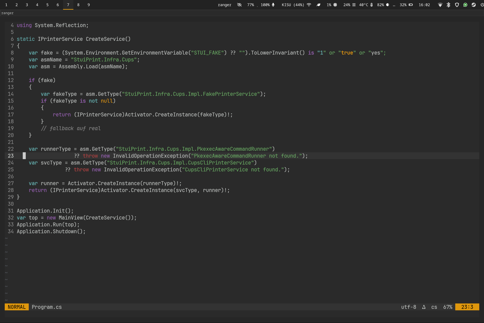
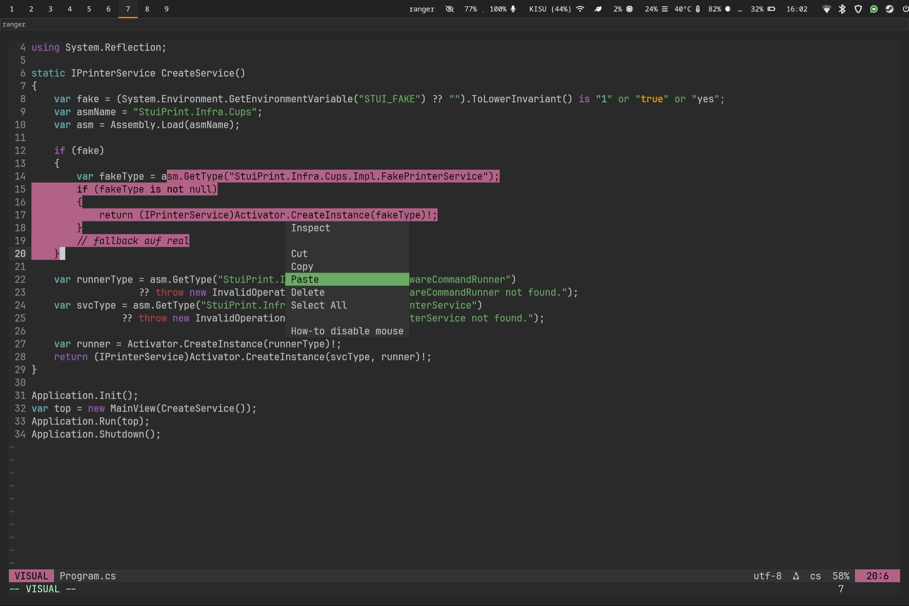
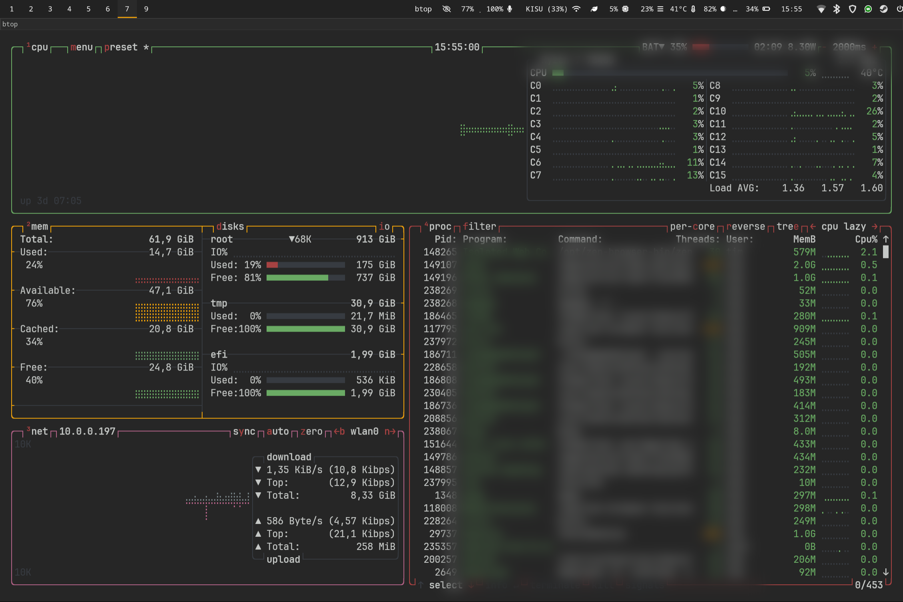

# Tim’s Dotfiles

Personal dotfiles for my Wayland/Sway setup on Arch (also tested on Debian & Fedora).  
Includes configs for **sway**, **waybar**, **wofi**, **wlogout**, **Neovim**, **ranger**, **kitty**, **GTK (3/4)**, **udiskie**, **systemd --user services**, and handy **bin** scripts.










---

## What’s inside

```bash
.
├── bin/                         # helper scripts (see below)
├── gtk/                         # GTK 3/4 + environment.d
├── install-arch-packages.sh     # Arch/Endeavour/Manjaro bootstrap
├── install-debian-packages.sh   # Debian/Ubuntu bootstrap
├── install-fedora-packages.sh   # Fedora bootstrap
├── kitty/                       # kitty terminal
├── lidm-system/etc/lidm.ini     # (optional) LIDM TTY/DM theme (system-wide)
├── nvim/                        # Neovim (cmp, autopairs, my colors)
├── ranger/                      # ranger config (nvim as editor, devicons, rifle)
├── screenshots/                 # screenshots used above
├── sway/                        # Sway WM (keybinds, autostart, lock, etc.)
├── systemd/                     # user units (cliphist, power sounds, etc.)
├── udiskie/                     # automount + notifications
├── waybar/                      # waybar modules + style
├── wlogout/                     # power menu (orange theme)
├── wofi/                        # app launcher
└── zsh/                         # .zshrc + powerlevel10k
```

### Highlights
- **Unified color scheme** (dark gray base, orange `#df970d` accents; normal mode orange, visual pink, insert green in Neovim).
- **Sway**: sensible keybinds (Mod=Super), Wofi launcher, Waybar, lock, screenshots (grim/slurp/swappy), power menu.
- **Waybar**: compact layout, orange accent under focused workspace.
- **Wlogout**: custom layout with extra entries (firmware, sway reload, waybar restart, audio restart) & orange hover.
- **Neovim**: minimal but comfy — completion (**nvim-cmp**), snippets (**LuaSnip**), autopairs, custom palette.
- **Ranger**: opens text/code in `nvim`, with handy mappings and devicons support.
- **Systemd --user**: clipboard history (**cliphist**), plug/unplug & low-battery sound hooks, power profile autoswitch.
- **bin/** scripts: quick clipboard picker, cheatsheet launcher, clipboard watchers, power sounds.

> See also: [`SECURITY.md`](SECURITY.md) for safety/OPSEC notes before publishing.

---

## Quick start

### 0) Install base tools
Make sure you have `git` and `stow`:
```bash
# Arch
sudo pacman -S --needed git stow

# Debian/Ubuntu
sudo apt update && sudo apt install -y git stow

# Fedora
sudo dnf install -y git stow
```

### 1) Clone
```bash
mkdir -p ~/Repositories
cd ~/Repositories
git clone https://github.com/timkicker/dotfiles.git
cd dotfiles
```

### 2) (Optional) Install packages
Pick the script for your distro:
```bash
# Arch / Endeavour / Manjaro
chmod +x install-arch-packages.sh && ./install-arch-packages.sh

# Debian / Ubuntu
chmod +x install-debian-packages.sh && ./install-debian-packages.sh

# Fedora
chmod +x install-fedora-packages.sh && ./install-fedora-packages.sh
```

### 3) Apply with GNU Stow
This creates symlinks from `$HOME` to this repo (idempotent & reversible).
```bash
stow -vt "$HOME" sway waybar wofi wlogout nvim ranger zsh kitty gtk udiskie systemd bin
```

If you get conflicts: either move/rename old files first **or** (advanced) adopt them:
```bash
# Danger zone: converts existing files into symlinks pointing back here
stow --adopt -vt "$HOME" sway waybar wofi wlogout nvim ranger zsh kitty gtk udiskie systemd bin
git status   # review changes; commit if OK
```

### 4) Enable user services (if wanted)
```bash
systemctl --user daemon-reload
systemctl --user enable --now cliphist.service power-sound.service ppd-autoswitch.service sound-events.service usb-sound.service
# (services only start if their binaries/configs exist)
```

### 5) (Optional) LIDM theme
This one is **system-wide**. Copy manually:
```bash
sudo cp -a lidm-system/etc/lidm.ini /etc/lidm.ini
```

### 6) Restart session / reload
- Sway: `swaymsg reload` (or log out/in)
- Waybar: it is auto-started by Sway; or `pkill -x waybar; waybar &`
- Verify: configs are symlinked into `$HOME` (`ls -l ~/.config/...`)

---

## Key pieces

### Sway
- Mod (Super) key bindings for focus/move, launcher (`wofi`), terminal (`kitty`), screenshots (grim/slurp/swappy), lock (`swaylock`), and power menu (`wlogout`).
- Autostarts: waybar, wallpaper restore, kanshi, nm-applet, udiskie, etc.

### Waybar
- Modules: workspaces, window, audio, network, power-profile, CPU/RAM/temp, backlight, keyboard-state, battery, clock, tray, power button.
- Styling via `waybar/style.css` — orange accent `#df970d` for focus/alerts.

### Wofi
- App launcher with my dark theme; Flatpaks are picked up via `.desktop` files.

### Wlogout
- Orange hover/focus; includes extra entries: firmware setup, sway reload, waybar restart, audio restart.

### Neovim
- Completion (`nvim-cmp`), snippets (`LuaSnip`), autopairs.
- Mode colors: Normal=orange, Visual=pink, Insert=green; dark gray background.

### Ranger
- Opens text/code with `nvim` (rifle rules).
- Cheats: press `e` to edit, `S` for shell, `R` reload, `yy`/`dd` to copy/move, etc.

### bin/ scripts
- `cheatsheets-rofi` — pick a file from `~/Documents/Cheatsheets` via rofi/wofi and open in `$EDITOR` (default `nvim`) in `kitty`.
- `clip-pick` — fuzzy pick from **cliphist** history via rofi/wofi.
- `cliphist-watch.sh` — background clipboard watchers for text/image & primary selection.
- `power-sound-monitor` — plays sounds on power plug/unplug & low battery.

Bind examples (in `~/.config/sway/config`):
```ini
bindsym $mod+h exec ~/.local/bin/cheatsheets-rofi
bindsym $mod+c exec ~/.local/bin/clip-pick
```

---

## Updating & Uninstalling

- Pull latest changes:
```bash
cd ~/Repositories/dotfiles
git pull
swaymsg reload   # or re-login
```

- Unstow (remove symlinks) for one module or all:
```bash
stow -Dt "$HOME" sway waybar wofi wlogout nvim ranger zsh kitty gtk udiskie systemd bin
```

- Add new dotfiles: create the same path inside this repo (e.g. `foo/.config/foo/config`), then `stow -vt "$HOME" foo` and commit.

---

## Troubleshooting

- **Stow conflicts**: move existing files away or use `stow --adopt` carefully (then commit the adopted files).
- **User services don’t start**: `systemctl --user status <name>.service -l`, check that binaries exist and paths in unit files are correct; `systemctl --user daemon-reload` after changes.
- **Flatpak apps missing in launcher**: ensure `~/.local/share/flatpak/exports/share` and `/var/lib/flatpak/exports/share` are in `XDG_DATA_DIRS` (see `gtk/.config/environment.d/90-flatpak.conf`).

---

## Security

Read [`SECURITY.md`](SECURITY.md). TL;DR: keep secrets out of dotfiles, review `.gitignore`, and consider templating sensitive values.

---

